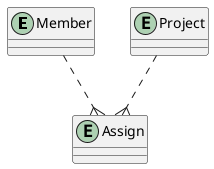
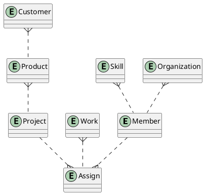

# Phase 0: 4連休の自由研究

* つい発想が発展して完成したことがなかったので、ミニマムでも完成を目指す
* 最低限の運用（自分利用）に耐える
* ログインとかアカウントとかも二の次

## 操作

### 共通

* 基準日
   * 日付範囲の基準になる日
   * 「14日前～基準日～62日後」を表示
   * [≪][≫]で7日ずつ前後する(<u>L, R</u>)
* モードスイッチ
   * ビューの切り替え（Project(<u>P</u>)/Member(<u>P</u>)）
* ☑グループ(<u>G</u>)
   * プロジェクト名を"/"区切りにすると、先頭をグループ名として表示する
* スクロール
* カレンダー

### プロジェクトビュー

* [＋]：プロジェクトの新規追加(<u>A</u>)
* [description]：プロジェクトの詳細（編集）
* [👪]：アサインメンバーの編集

### メンバービュー

* [＋]：メンバーの新規追加(<u>A</u>)
* [description]：メンバーの詳細（編集）
* [👪]：アサインメンバーの編集

## データ構造

* ほんとに最低限
* PlantUMLで見れる
   * [オンラインサーバ](http://www.plantuml.com/plantuml/uml/SyfFKj2rKt3CoKnELR1Io4ZDoSa70000)

今のデータ構造

あちこちに発展できそうで困る

## TODO:

### 仕様的なこと

* トラックパッド2本指の横スクロールに対応できてない
* メンバーにアサイン期間設定したい
   * member.start, member.last
   * NULLのときproject.start, project.last
* データから類推できる（やってない
   * 大まかな月次の稼働（売上
   * 将来的な稼働予定
* 【済】 ~~project.noteはmarkdownに対応させたい~~
   * ~~Wikiトップページ的に機能させたい~~

### 開発的なこと

* 開発コード「丼助（どんぶりスケジュール）」はこの先…？
* Activerecordマイグレーションに対応させたい
* RSpecに移行したい
   * db/test.rbが変更に追随できてない
* Rake入れてない
* VueはCLIでやるべきなの？
